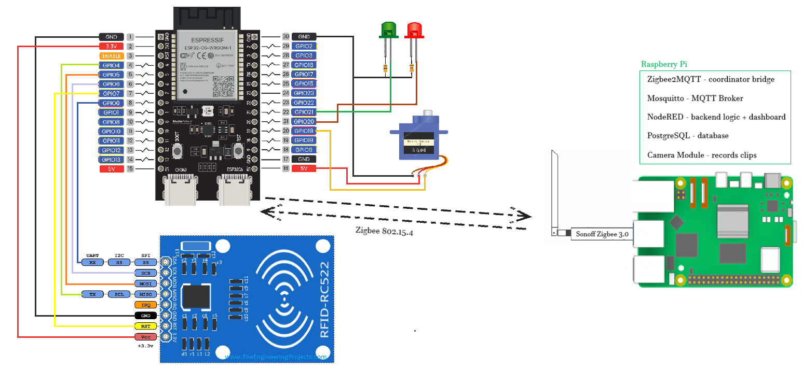

# ESP32 Zigbee Access Control Node

Firmware for the ESP32-C6 access node in a distributed RFID-based access control 
system. This is part of a group project - the ESP32 acts as a field node 
that reads RFID cards and communicates with a central Raspberry Pi server over 
Zigbee to authorize or deny access.

---

## Project Overview

Traditional access control systems rely on wired connections or local 
verification, which limits scalability. This system uses Zigbee for reliable, 
low-power wireless communication between distributed access nodes and a central 
server - making it easy to scale across multiple entry points.

The full system consists of:
- **ESP32-C6 access node** (this repository) - reads RFID, communicates via 
  Zigbee, controls the door lock
- **Raspberry Pi central server** - Zigbee coordinator via Zigbee2MQTT, user 
  database, backend logic, camera recording

---

## System Architecture

```
RFID Card
    ↓ (SPI)
  RC522
    ↓
ESP32-C6 ──[Zigbee IEEE 802.15.4]──► Sonoff Zigbee Dongle
                                              ↓
                                       Zigbee2MQTT
                                              ↓
                                    MQTT Broker (Mosquitto)
                                              ↓
                                          Node-RED
                                         ↙        ↘
                                  PostgreSQL     Notifications
                                  (access log)     (Telegram)
                                         ↓
                                    Dashboard GUI
```

---

## My Responsibilities

- Wiring and integrating the RC522 RFID reader with ESP32-C6
- Implementing Zigbee End Device firmware using the Arduino Zigbee library
- Integrating video recording
- Setting up and configuring Zigbee2MQTT on the coordinator side
- Connecting servo for physical lock control
- Status LED logic (access granted / denied)

---

## Hardware

| Component | Purpose |
|---|---|
| Raspberry Pi | Central server - Zigbee coordinator, user database, backend, camera recording |
| ESP32-C6 | Main microcontroller (has native Zigbee support) |
| RC522 RFID reader | Reads user cards (UID) |
| Servo | Controls door lock mechanism |
| LEDs (green/red) | Visual access feedback |

---

## Wiring Diagram



### RC522 RFID Reader
| RC522 Pin | ESP32-C6 GPIO | Description |
|---|---|---|
| SDA (CS) | GPIO8 | Chip Select |
| SCK | GPIO6 | SPI Clock |
| MOSI | GPIO5 | SPI MOSI |
| MISO | GPIO4 | SPI MISO |
| IRQ | - | Not connected |
| GND | GND | Ground |
| RST | GPIO7 | Reset |
| 3.3V | 3.3V | Power |

### LEDs
| Component | ESP32-C6 GPIO | Description |
|---|---|---|
| Green LED anode (+) | GPIO21 | Access granted |
| Red LED anode (+) | GPIO20 | Access denied |
| Both cathodes (-) | 330Ω -> GND | Current limiting resistor required |

### SG90 Servo
| Servo Wire | ESP32-C6 | Description |
|---|---|---|
| Signal (yellow) | GPIO19 | PWM control |
| VCC (red) | 5V | Power |
| GND (brown) | GND | Ground |

---

## How It Works

1. User scans RFID card at the reader
2. ESP32-C6 reads the card UID
3. UID is sent via Zigbee to the Zigbee2MQTT coordinator on Raspberry Pi
4. Raspberry Pi checks the UID against the user database
5. Authorization result is sent back to ESP32-C6 via Zigbee
6. If granted: servo unlocks the door, green LED on, event logged. Raspberry Pi triggers the camera to record a short clip of the entry. Recording is saved locally and linked to the access log entry.
7. If denied: lock stays closed, red LED on, event logged

---

## Raspberry Pi Stack

| Software | Purpose |
|---|---|
| Raspberry Pi OS Lite (64-bit) | Headless operating system |
| Zigbee2MQTT | Zigbee coordinator bridge |
| Mosquitto | MQTT broker |
| Node-RED | Backend logic + GUI dashboard |
| PostgreSQL | Access log and authorized cards database |

---

## Repository Structure

```
├── zigbeeTest/         # Zigbee connectivity test (ESP32-C6 <-> Zigbee2MQTT)
│   └── zigbeeTest.ino
├── rfidAccess/         # (coming soon) Full RFID + Zigbee + servo firmware
├── wiringDiagram.png  # Hardware wiring diagram
└── README.md
```
---

## Setup & Flashing

**Requirements:**
- Arduino IDE
- ESP32 Arduino core with Zigbee support

**Arduino IDE settings:**
- Tools -> Partition Scheme -> **Zigbee 4MB with spiffs**
- Tools -> Zigbee Mode -> **Zigbee End Device**
- Board: `ESP32-C6 Dev Module`

**Steps:**
1. Clone the repository
2. Open the .ino file in Arduino IDE
3. Apply settings above
4. Upload to ESP32-C6

---

## Tech Stack

- **Language:** C++ (Arduino framework)
- **Communication:** Zigbee (native ESP32-C6) via Zigbee2MQTT
- **Protocols:** SPI (RFID)
- **Hardware:** ESP32-C6, RC522, servo, Sonoff Zigbee Dongle

---

## Known Limitations

- ESP32-C6 supports either Zigbee **or** WiFi at a time, not simultaneously
- Zigbee range ~10–30m indoors depending on obstacles

---

## Status

Work in progress - university group project
