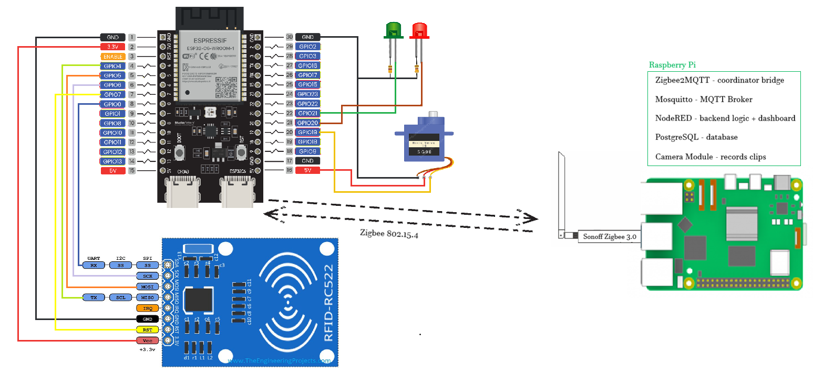

# ESP32 Zigbee Access Control Node

Firmware for the ESP32-C6 access node in a distributed RFID-based access control 
system. This is part of a group project - the ESP32 acts as a field node 
that reads RFID cards and communicates with a central Raspberry Pi server over 
Zigbee to authorize or deny access.

---

## Project Overview

Traditional access control systems rely on wired connections or local 
verification, which limits scalability. This system uses Zigbee for reliable, 
low-power wireless communication between distributed access nodes and a central 
server - making it easy to scale across multiple entry points.

The full system consists of:
- **ESP32-C6 access node** (this repository) - reads RFID, communicates via 
  Zigbee, controls the door lock
- **Raspberry Pi central server** - Zigbee coordinator via Zigbee2MQTT,
  database, backend logic, camera recording, admin panel

---

## System Architecture

```
RFID Card
    ↓ (SPI)
  RC522
    ↓
ESP32-C6 ──[Zigbee IEEE 802.15.4]──► Sonoff Zigbee Dongle
                                              ↓
                                       Zigbee2MQTT
                                              ↓
                                    MQTT Broker (Mosquitto)
                                              ↓
                                          Node-RED
                                         ↙        ↘
                                  PostgreSQL     Admin Panel
                                  (access log)     (Flask)
```

---

## My Responsibilities

- Wiring and integrating the RC522 RFID reader with ESP32-C6
- Writing ESP32-C6 firmware in C using ESP-IDF and the Arduino Zigbee library
- Implementing the RFID driver (`rfid_rc522.c`) and Zigbee handler (`zigbee_handler.c`)
- Setting up and configuring Zigbee2MQTT on the coordinator side
- Integrating camera recording on Raspberry Pi with face detection (OpenCV)
- Connecting servo for physical lock control
- Status LED logic (access granted / denied)
- Building the Flask REST API and HTML admin panel

---

## Hardware

| Component | Purpose |
|---|---|
| Raspberry Pi | Central server - Zigbee coordinator, database, backend, camera recording |
| ESP32-C6 | Main microcontroller (has native Zigbee support) |
| RC522 RFID reader | Reads user cards (UID) |
| Servo | Controls door lock mechanism |
| LEDs (green/red) | Visual access feedback |
| Sonoff Zigbee Dongle | Zigbee USB coordinator for Raspberry Pi |
| Camera Module (IMX708) | Records entry footage |

---

## Wiring Diagram



### RC522 RFID Reader
| RC522 Pin | ESP32-C6 GPIO | Description |
|---|---|---|
| SDA (CS) | GPIO8 | Chip Select |
| SCK | GPIO6 | SPI Clock |
| MOSI | GPIO5 | SPI MOSI |
| MISO | GPIO4 | SPI MISO |
| IRQ | - | Not connected |
| GND | GND | Ground |
| RST | GPIO7 | Reset |
| 3.3V | 3.3V | Power |

### LEDs
| Component | ESP32-C6 GPIO | Description |
|---|---|---|
| Green LED anode (+) | GPIO21 | Access granted |
| Red LED anode (+) | GPIO20 | Access denied |
| Both cathodes (-) | 330Ω -> GND | Current limiting resistor required |

### SG90 Servo
| Servo Wire | ESP32-C6 | Description |
|---|---|---|
| Signal (yellow) | GPIO19 | PWM control |
| VCC (red) | 5V | Power |
| GND (brown) | GND | Ground |

---

## How It Works

1. User scans RFID card at the reader
2. ESP32-C6 reads the card UID
3. UID is sent via Zigbee to the Zigbee2MQTT coordinator on Raspberry Pi
4. Raspberry Pi checks the UID against the user database
5. Authorization result is sent back to ESP32-C6 via Zigbee
6. If granted: servo unlocks the door, green LED on, event logged. Raspberry Pi triggers the camera to record a 10-second clip of the entry with face detection. Recording is saved locally and linked to the access log entry.
7. If denied: lock stays closed, red LED on, event logged

---

## Raspberry Pi Stack

| Software | Purpose |
|---|---|
| Raspberry Pi OS Lite (64-bit) | Headless operating system |
| Zigbee2MQTT | Zigbee coordinator bridge |
| Mosquitto | MQTT broker |
| Node-RED | Backend logic + GUI dashboard |
| PostgreSQL | Access log and authorized cards database |
| Flask | REST API for admin panel |
| OpenCV + Picamera2 | Camera recording with face detection |

---

## Repository Structure

```
├── zigbeeTest/         # Zigbee connectivity test (ESP32-C6 <-> Zigbee2MQTT)
│   └── zigbeeTest.ino
├── espFirmware/
│   ├── main/
│   │   ├── main.c               # Entry point, app logic
│   │   ├── rfid_rc522.c/.h      # RC522 RFID driver over SPI
│   │   ├── zigbee_handler.c/.h  # Zigbee End Device communication
│   │   ├── idf_component.yml
│   │   ├── CMakeLists.txt
│   │   └── Kconfig.projbuild
│   ├── CMakeLists.txt
│   ├── partitions.csv
│   ├── sdkconfig.defaults
│   └── sdkconfig.defaults.esp32c6
├── adminPanel/
│   ├── admin.html                   # Admin panel UI
│   ├── app.js                       # Admin panel JavaScript
│   ├── app.py                       # Flask REST API
│   └── styles.css                   # Admin panel styles
├── record.py                    # Camera recording script with face detection
├── wiringDiagram.png            # Hardware wiring diagram
└── README.md
```
---

## Setup & Flashing

**Requirements:**
- [ESP-IDF v6.0](https://docs.espressif.com/projects/esp-idf/en/latest/)
- ESP-Zigbee SDK
**Flash:**
 
```powershell
# Set up ESP-IDF environment
Set-ExecutionPolicy -Scope Process -ExecutionPolicy Bypass
C:\Espressif\tools\Microsoft.v6.0.PowerShell_profile.ps1
 
cd espFirmware
idf.py set-target esp32c6
idf.py build
idf.py -p COM7 -b 115200 flash monitor
```
 
**Partition scheme:** `partitions.csv` (custom - required for Zigbee stack)

---

## Admin Panel Setup
 
The admin panel consists of a Flask API (`app.py`) running on the Raspberry Pi and a static HTML file (`admin.html`).
 
**Install dependencies on Raspberry Pi:**
 
```bash
pip install flask flask-cors psycopg2-binary --break-system-packages
```
 
**Run the API:**
 
```bash
python3 app.py
```
 
**Open the panel:**
 
Navigate to `http://<raspberry-pi-ip>:5000` in a browser on the same network.
 
The panel provides:
- Access log history
- Video recordings with playback and face count
- User management (add, disable, delete cards)
- Dashboard with activity stats

---

## Tech Stack

- **Language:** C (ESP-IDF framework), C++ (for tests, Arduino framework)
- **Communication:** Zigbee (native ESP32-C6) via Zigbee2MQTT
- **Protocols:** SPI (RFID)
- **Hardware:** ESP32-C6, RC522, servo, Sonoff Zigbee Dongle

---

## Known Limitations

- ESP32-C6 supports either Zigbee **or** WiFi at a time, not simultaneously
- Zigbee range ~10–30m indoors depending on obstacles
- Flask runs as a development server - not intended for production use

---

## Status

University group project - core functionality complete.
